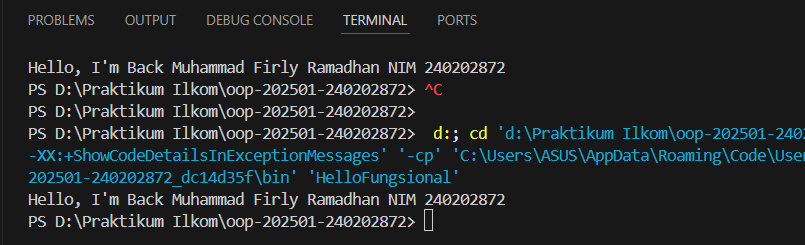
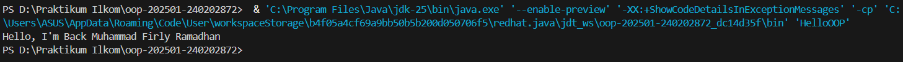
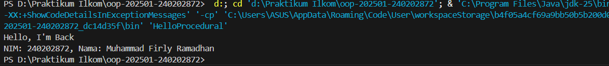

# Laporan Praktikum Minggu 1
Topik: Setup hello pos

## Identitas
- Nama  : [Muhammad Firly Ramadhan]
- NIM   : [240202872]
- Kelas : [3IKRB]

---

## Tujuan
Mahasiswa memahami tiga paradigma utama dalam Java: prosedural, berorientasi objek (OOP), dan fungsional.

Mahasiswa mampu membuat program sederhana menggunakan ketiga paradigma tersebut.

Mahasiswa dapat membedakan kelebihan dan kekurangan tiap pendekatan.
---

## Dasar Teori
Pemrograman Prosedural adalah pendekatan tradisional yang berfokus pada urutan langkah-langkah atau prosedur yang dijalankan untuk menyelesaikan tugas.

Pemrograman Berorientasi Objek (OOP) menggunakan konsep objek yang memiliki atribut (data) dan method (perilaku), serta mendukung enkapsulasi, pewarisan, dan polimorfisme.

Pemrograman Fungsional menekankan fungsi sebagai unit utama, menggunakan lambda expression, dan interface fungsional untuk menulis kode yang lebih deklaratif.

Java mendukung ketiga paradigma ini secara bersamaan, memungkinkan programmer memilih gaya yang paling sesuai.

Pemahaman ketiga paradigma penting untuk menulis kode yang efisien, modular, dan mudah dikelola.
---

## Langkah Praktikum
1. Siapkan lingkungan pemrograman Java (misalnya VS Code, IntelliJ IDEA, atau terminal).
2. Buat tiga file program berikut:

   * `HelloProcedural.java`
   * `HelloOOP.java`
   * `HelloFungsional.java`
3. Jalankan masing-masing program menggunakan perintah:

   ```
   javac NamaFile.java
   java NamaFile
   ```
4. Bandingkan hasil keluaran dan analisis perbedaan pendekatan tiap paradigma.
5. Lakukan commit dengan pesan:

   ```
   Add tiga paradigma Java: prosedural, OOP, dan fungsional
   ```

---

## Kode Program
### 1️⃣ HelloProcedural.java

```java
// HelloProcedural.java
public class HelloProcedural {
   public static void main(String[] args) {
      String nim = "240202872";
      String nama = "Muhammad Firly Ramadhan";
      System.out.println("Hello, I'm Back");
      System.out.println("NIM: " + nim + ", Nama: " + nama);
   }
}
```

### 2️⃣ HelloOOP.java

```java
class Mahasiswa {
    String nama;
    int NIM;

    Mahasiswa(String n, int u) {
        nama = n;
        NIM = u;
    }

    void sapa() {
        System.out.println("Hello, I'm Back " + nama);
    }
}

public class HelloOOP {
    public static void main(String[] args) {
        Mahasiswa m = new Mahasiswa("Muhammad Firly Ramadhan", 240202872);
        m.sapa();
    }
}
```

### 3️⃣ HelloFungsional.java

```java
import java.util.function.BiConsumer;

public class HelloFungsional {
    public static void main(String[] args) {
        BiConsumer<String, Integer> sapa = (nama, NIM) ->
            System.out.println("Hello, I'm Back " + nama + " NIM " + NIM);

        sapa.accept("Muhammad Firly Ramadhan", 240202872);
    }
}
```

---


## Hasil Eksekusi
**HelloFungsional**



**HelloOOP**

**HelloProsedural**

---

## Analisis
Ketiga pendekatan pemrograman di atas menunjukkan perbedaan cara berpikir dalam menulis kode di Java. Pada program prosedural, semua instruksi ditempatkan di dalam satu fungsi main, dieksekusi secara berurutan dari atas ke bawah. Pendekatan ini sangat sederhana dan mudah dipahami, cocok untuk program berskala kecil. Namun, karena tidak ada struktur objek atau pemisahan logika, pendekatan ini menjadi kurang efisien ketika program bertambah besar dan kompleks.

Pada program berorientasi objek (OOP), logika dibungkus ke dalam sebuah class bernama Mahasiswa, yang memiliki atribut nama dan NIM serta method sapa(). Dengan cara ini, data dan perilaku disatukan ke dalam objek, sehingga kode lebih terstruktur, mudah dikembangkan, dan mendukung konsep seperti enkapsulasi. Dibandingkan dengan prosedural, OOP membuat program lebih modular dan fleksibel karena setiap objek dapat digunakan kembali.

Sementara itu, program fungsional menggunakan konsep lambda expression dan interface fungsional BiConsumer. Pendekatan ini lebih ringkas dan ekspresif karena tidak perlu membuat class atau method tambahan. Fungsi dapat didefinisikan langsung sebagai ekspresi dan dijalankan sesuai kebutuhan. Namun, gaya ini memerlukan pemahaman tambahan mengenai konsep fungsi tingkat tinggi (higher-order function) dan mungkin kurang intuitif bagi pemula.

Secara keseluruhan, ketiga paradigma tersebut menghasilkan output yang mirip, tetapi dengan struktur dan filosofi yang berbeda. Java sebagai bahasa multiparadigma memberikan kebebasan bagi programmer untuk memilih pendekatan yang paling sesuai dengan kebutuhan aplikasi.
---

## Kesimpulan
* Java mendukung tiga paradigma pemrograman: prosedural, OOP, dan fungsional.
* Setiap paradigma memiliki karakteristik dan keunggulan tersendiri.
* Pemrograman **prosedural** cocok untuk tugas sederhana, **OOP** cocok untuk sistem kompleks dan modular, sedangkan **fungsional** cocok untuk operasi ringkas dan ekspresif.
* Dengan memahami ketiganya, mahasiswa dapat memilih paradigma yang paling efisien untuk konteks program tertentu.

---

## Quiz
1. Apakah OOP selalu lebih baik dari prosedural?

Jawab : Tidak. OOP lebih baik untuk program besar dan kompleks, sedangkan prosedural lebih efisien untuk program kecil yang sederhana.

2. Kapan functional programming lebih cocok digunakan dibanding OOP atau prosedural?

Jawab : Saat program fokus pada pemrosesan data, transformasi koleksi, atau pekerjaan paralel tanpa banyak perubahan keadaan (stateless).

3. Bagaimana paradigma (prosedural, OOP, fungsional) memengaruhi maintainability dan scalability aplikasi?

Jawab : OOP dan fungsional lebih mudah dirawat dan dikembangkan karena terstruktur dan modular, sedangkan prosedural sulit dikelola jika proyek besar.

4. Mengapa OOP lebih cocok untuk mengembangkan aplikasi POS dibanding prosedural?

Jawab : Karena POS memiliki banyak entitas (produk, kasir, transaksi) yang mudah dimodelkan sebagai objek sehingga kode lebih rapi dan mudah diperluas.

5. Bagaimana paradigma fungsional dapat membantu mengurangi kode berulang (boilerplate code)?

Jawab : Dengan menggunakan lambda dan fungsi bawaan seperti map, filter, dan reduce, kode menjadi lebih singkat dan tidak berulang.