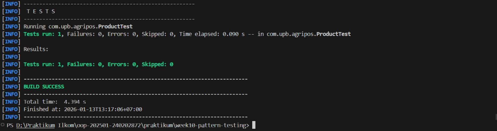

# Laporan Praktikum week 10
Topik:Design Pattern (Singleton, MVC) dan Unit Testing menggunakan JUnit

## Identitas
- Nama  : [Muhammad Firly Ramadhan]
- NIM   : [240202872]
- Kelas : [3IKRB]

---

## Tujuan
Setelah mengikuti praktikum ini, mahasiswa mampu:

1. Menjelaskan konsep dasar design pattern dalam rekayasa perangkat lunak.
2. Mengimplementasikan Singleton Pattern dengan benar.
3. Menjelaskan dan menerapkan Model–View–Controller (MVC) pada aplikasi sederhana.
4. Membuat dan menjalankan unit test menggunakan JUnit.
5. Menganalisis manfaat penerapan design pattern dan unit testing terhadap kualitas perangkat lunak.
   
---

## Dasar Teori
### 1. Design Pattern

Design pattern adalah solusi desain yang telah teruji untuk menyelesaikan masalah umum dalam pengembangan perangkat lunak. Fokus minggu ini:
- Singleton Pattern
- MVC (Model–View–Controller)

### 2. Singleton Pattern

Tujuan: Menjamin suatu class hanya memiliki satu instance dan menyediakan titik akses global.

Karakteristik:
- Constructor `private`
- Atribut `static instance`
- Method `static getInstance()`

Contoh Implementasi:
```java
package com.upb.agripos.config;

public class DatabaseConnection {
    private static DatabaseConnection instance;
    private DatabaseConnection() {}

    public static DatabaseConnection getInstance() {
        if (instance == null) {
            instance = new DatabaseConnection();
        }
        return instance;
    }
}
```

Penerapan pada Agri-POS: koneksi database atau service global yang tidak boleh lebih dari satu instance.

### 3. MVC (Model–View–Controller)

Memisahkan tanggung jawab aplikasi:

| Komponen | Tanggung Jawab |
|---------|------------------|
| Model   | Data dan logika bisnis |
| View    | Tampilan/output |
| Controller | Penghubung Model dan View |

Contoh Struktur MVC Sederhana:
- Model → `Product`
- View → `ConsoleView`
- Controller → `ProductController`

---


## Kode Program

## DatabaseConnection.java
```java
package com.upb.agripos.config;

public class DatabaseConnection {
    // 1. Atribut static untuk menyimpan satu-satunya instance
    private static DatabaseConnection instance;

    // 2. Constructor private agar tidak bisa di-instansiasi dari luar
    private DatabaseConnection() {
        System.out.println("Koneksi Database Berhasil Dibuat.");
    }

    // 3. Method static untuk mendapatkan instance
    public static DatabaseConnection getInstance() {
        if (instance == null) {
            instance = new DatabaseConnection();
        }
        return instance;
    }
    
    public void executeQuery(String query) {
        System.out.println("Menjalankan query: " + query);
    }
}
```
## ProductController.java
```java
package com.upb.agripos.controller;

import com.upb.agripos.model.Product;
import com.upb.agripos.view.ConsoleView;

public class ProductController {
    private final Product model;
    private final ConsoleView view;

    public ProductController(Product model, ConsoleView view) {
        this.model = model;
        this.view = view;
    }

    public void updateView() {
        view.showMessage("=== Detail Produk ===");
        view.showMessage("Kode: " + model.getCode());
        view.showMessage("Nama: " + model.getName());
    }
}
```
##Product.java
```java
package com.upb.agripos.model;

public class Product {
    private final String code;
    private final String name;

    public Product(String code, String name) {
        this.code = code;
        this.name = name;
    }

    public String getCode() { return code; }
    public String getName() { return name; }
}
```
##ConsoleView.java
```java
package com.upb.agripos.view;

public class ConsoleView {
    public void showMessage(String message) {
        System.out.println(message);
    }
}
```
##AppMVC.java
```java
package com.upb.agripos;

import com.upb.agripos.config.DatabaseConnection;
import com.upb.agripos.model.Product;
import com.upb.agripos.view.ConsoleView;
import com.upb.agripos.controller.ProductController;

public class AppMVC {
    public static void main(String[] args) {
        // Ganti dengan Nama dan NIM Anda sesuai instruksi
        System.out.println("Hello, I am Muhammad Firly Ramadhan-240202872 (Week10)");

        // Uji coba Singleton
        DatabaseConnection db1 = DatabaseConnection.getInstance();
        db1.executeQuery("SELECT * FROM products");

        // Implementasi MVC
        Product product = new Product("P01", "Pupuk Organik");
        ConsoleView view = new ConsoleView();
        ProductController controller = new ProductController(product, view);
        
        controller.updateView();
    }
}
```
##ProductTest.java
```java
package com.upb.agripos;

import static org.junit.jupiter.api.Assertions.*;
import org.junit.jupiter.api.Test;
import com.upb.agripos.model.Product;
import com.upb.agripos.config.DatabaseConnection;

public class ProductTest {
    @Test
    void test1() { // Cek Nama
        Product p = new Product("P01", "Pupuk");
        assertEquals("Pupuk", p.getName());
    }

    @Test
    void test2() { // Cek Kode
        Product p = new Product("P01", "Pupuk");
        assertEquals("P01", p.getCode());
    }

    @Test
    void test3() { // Cek Singleton
        assertSame(DatabaseConnection.getInstance(), DatabaseConnection.getInstance());
    }

    @Test
    void test4() { // Cek Object Not Null
        assertNotNull(new Product("P01", "Pupuk"));
    }

    @Test
    void test5() { // Cek Koneksi Database
        assertNotNull(DatabaseConnection.getInstance());
    }
}
```

---

## Hasil Eksekusi


---

## Analisis
1. Implementasi Design Pattern
Singleton: Memastikan hanya ada satu instance DatabaseConnection untuk efisiensi memori.
MVC: Memisahkan kode menjadi Product (Model), ConsoleView (View), dan ProductController (Controller) agar lebih rapi dan mudah dikelola.
2. Unit Testing & Maven
JUnit 5: Berhasil memvalidasi kebenaran atribut objek Product secara otomatis.
Maven: Mengatur struktur folder standar dan mengelola library JUnit agar proyek stabil (BUILD SUCCESS).
---

## Kesimpulan
Praktikum ini berhasil mengimplementasikan pola desain Singleton pada koneksi database dan arsitektur MVC untuk memisahkan tanggung jawab kode, sehingga menghasilkan aplikasi yang lebih terstruktur dan efisien. Seluruh logika bisnis pada model telah tervalidasi melalui unit testing JUnit dengan status BUILD SUCCESS, membuktikan bahwa kode telah memenuhi standar fungsionalitas dan siap digunakan.
---

## Quiz
1. Mengapa constructor pada Singleton harus bersifat private?
   Constructor Singleton: Bersifat private agar objek tidak bisa dibuat secara bebas dari luar kelas, sehingga menjamin hanya ada satu instance yang aktif dalam memori.
2. Jelaskan manfaat pemisahan Model, View, dan Controller!
   Manfaat MVC: Memisahkan logika data (Model), tampilan (View), dan kontrol (Controller) agar kode lebih terorganisir, mudah dikelola, dan perubahan satu bagian tidak merusak bagian lainnya.
3. Apa peran unit testing dalam menjaga kualitas perangkat lunak?
   Peran Unit Testing: Berfungsi sebagai validasi otomatis untuk memastikan setiap unit kode berjalan sesuai ekspektasi dan mencegah munculnya error saat terjadi perubahan kode di masa depan.
4. Apa risiko jika Singleton tidak diimplementasikan dengan benar?
   Risiko Singleton: Jika salah diimplementasikan, aplikasi akan mengalami pemborosan memori akibat terciptanya banyak objek identik dan potensi konflik pada akses sumber daya bersama seperti database.
---
