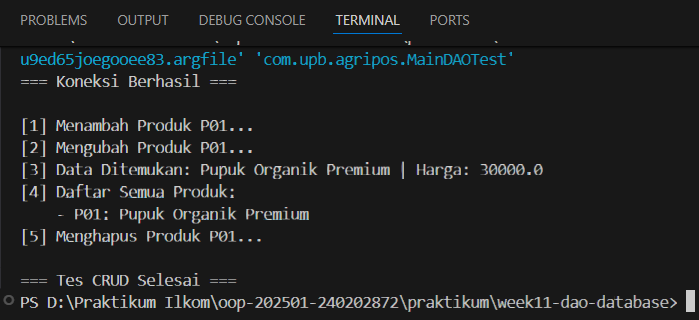

# Laporan Praktikum week11
Topik: Data Access Object (DAO) dan CRUD Database dengan JDBC

## Identitas
- Nama  : [Muhammad Firly Ramadhan]
- NIM   : [240202872]
- Kelas : [3IKRB]

---

## Tujuan
1. Menjelaskan konsep Data Access Object (DAO) dalam pengembangan aplikasi OOP.
2. Menghubungkan aplikasi Java dengan basis data menggunakan JDBC.
3. Mengimplementasikan operasi CRUD (Create, Read, Update, Delete) secara lengkap.
4. Mengintegrasikan DAO dengan class aplikasi OOP sesuai prinsip desain yang baik.


---

## Dasar Teori
### 1. Konsep Data Access Object (DAO)

DAO adalah pola desain yang memisahkan logika akses data dari logika bisnis aplikasi. Dengan DAO, perubahan teknologi basis data tidak memengaruhi logika utama aplikasi.

Manfaat DAO:
- Kode lebih terstruktur dan mudah dipelihara
- Mengurangi tight coupling antara aplikasi dan database
- Mendukung pengujian dan pengembangan lanjutan

---

### 2. JDBC dan Koneksi Database

JDBC (Java Database Connectivity) digunakan untuk menghubungkan aplikasi Java dengan basis data relasional, dalam praktikum ini menggunakan PostgreSQL.

Komponen utama JDBC:
- DriverManager
- Connection
- PreparedStatement
- ResultSet

---

## Kode Program
## sql
```java
CREATE TABLE products (
    code VARCHAR(10) PRIMARY KEY,
    name VARCHAR(100),
    price DOUBLE PRECISION,
    stock INT
);
```
## productdao
```java
package com.upb.agripos.dao;

import java.util.List;
import com.upb.agripos.model.Product;

public interface ProductDAO {
    void insert(Product product) throws Exception;
    Product findByCode(String code) throws Exception;
    List<Product> findAll() throws Exception;
    void update(Product product) throws Exception;
    void delete(String code) throws Exception;
}
```
## Productdaoimpl
```java
package com.upb.agripos.dao;

import java.sql.*;
import java.util.ArrayList;
import java.util.List;
import com.upb.agripos.model.Product;

public class ProductDAOImpl implements ProductDAO {
    private final Connection connection;

    public ProductDAOImpl(Connection connection) {
        this.connection = connection;
    }

    @Override
    public void insert(Product p) throws Exception {
        String sql = "INSERT INTO products(code, name, price, stock) VALUES (?, ?, ?, ?)";
        try (PreparedStatement ps = connection.prepareStatement(sql)) {
            ps.setString(1, p.getCode());
            ps.setString(2, p.getName());
            ps.setDouble(3, p.getPrice());
            ps.setInt(4, p.getStock());
            ps.executeUpdate();
        }
    }

    @Override
    public Product findByCode(String code) throws Exception {
        String sql = "SELECT * FROM products WHERE code = ?";
        try (PreparedStatement ps = connection.prepareStatement(sql)) {
            ps.setString(1, code);
            try (ResultSet rs = ps.executeQuery()) {
                if (rs.next()) {
                    return new Product(
                        rs.getString("code"),
                        rs.getString("name"),
                        rs.getDouble("price"),
                        rs.getInt("stock")
                    );
                }
            }
        }
        return null;
    }

    @Override
    public List<Product> findAll() throws Exception {
        List<Product> list = new ArrayList<>();
        String sql = "SELECT * FROM products";
        try (PreparedStatement ps = connection.prepareStatement(sql);
             ResultSet rs = ps.executeQuery()) {
            while (rs.next()) {
                list.add(new Product(
                    rs.getString("code"),
                    rs.getString("name"),
                    rs.getDouble("price"),
                    rs.getInt("stock")
                ));
            }
        }
        return list;
    }

    @Override
    public void update(Product p) throws Exception {
        String sql = "UPDATE products SET name=?, price=?, stock=? WHERE code=?";
        try (PreparedStatement ps = connection.prepareStatement(sql)) {
            ps.setString(1, p.getName());
            ps.setDouble(2, p.getPrice());
            ps.setInt(3, p.getStock());
            ps.setString(4, p.getCode());
            ps.executeUpdate();
        }
    }

    @Override
    public void delete(String code) throws Exception {
        String sql = "DELETE FROM products WHERE code=?";
        try (PreparedStatement ps = connection.prepareStatement(sql)) {
            ps.setString(1, code);
            ps.executeUpdate();
        }
    }
}
```
## Maindaotest
```java
package com.upb.agripos;

import java.sql.Connection;
import java.sql.DriverManager;
import com.upb.agripos.dao.ProductDAO;
import com.upb.agripos.dao.ProductDAOImpl;
import com.upb.agripos.model.Product;
import java.util.List;

public class MainDAOTest {
    public static void main(String[] args) {
        String url = "jdbc:postgresql://localhost:5432/agripos";
        String user = "postgres";
        String password = "admin321"; // Ganti jika password PostgreSQL Anda berbeda!

        try {
            // Memastikan driver PostgreSQL dimuat
            Class.forName("org.postgresql.Driver");
            
            try (Connection conn = DriverManager.getConnection(url, user, password)) {
                System.out.println("=== Koneksi Berhasil ===");

                ProductDAO dao = new ProductDAOImpl(conn);

                // 1. CREATE (Insert)
                System.out.println("\n[1] Menambah Produk P01...");
                dao.insert(new Product("P01", "Pupuk Organik", 25000, 10));

                // 2. UPDATE
                System.out.println("[2] Mengubah Produk P01...");
                dao.update(new Product("P01", "Pupuk Organik Premium", 30000, 8));

                // 3. READ (Find By Code)
                Product p = dao.findByCode("P01");
                if (p != null) {
                    System.out.println("[3] Data Ditemukan: " + p.getName() + " | Harga: " + p.getPrice());
                }

                // 4. READ ALL
                System.out.println("[4] Daftar Semua Produk:");
                List<Product> allProducts = dao.findAll();
                for (Product item : allProducts) {
                    System.out.println("    - " + item.getCode() + ": " + item.getName());
                }

                // 5. DELETE
                // Hapus baris di bawah jika ingin data tetap ada di database
                System.out.println("[5] Menghapus Produk P01...");
                dao.delete("P01");
                
                System.out.println("\n=== Tes CRUD Selesai ===");

            }
        } catch (ClassNotFoundException e) {
            System.err.println("Error: Driver JDBC tidak ditemukan! Tambahkan .jar ke Referenced Libraries.");
        } catch (Exception e) {
            System.err.println("Error: " + e.getMessage());
            e.printStackTrace();
        }
    }
}
```

---

## Hasil Eksekusi



---

## Analisis
1. Pemisahan Logika (DAO): Menggunakan pola Data Access Object untuk memisahkan logika bisnis aplikasi dari detail teknis akses database.
2. Struktur Model-Interface: Membagi kode ke dalam class Product (data), interface ProductDAO (kontrak), dan ProductDAOImpl (eksekusi SQL) agar lebih rapi.
3. Keamanan Query: Menggunakan PreparedStatement untuk mencegah SQL Injection saat melakukan operasi CRUD.
4. Konektivitas JDBC: Menghubungkan Java ke PostgreSQL menggunakan DriverManager dengan parameter URL, username, dan password yang spesifik.
5. Manajemen Resource: Menerapkan penutupan koneksi otomatis agar tidak terjadi kebocoran memori pada database.
---

## Kesimpulan
*Penerapan pola desain DAO dalam praktikum ini berhasil memisahkan logika bisnis dengan akses data, sehingga kode program menjadi lebih terstruktur dan mudah dipelihara. Selain itu, penggunaan JDBC dengan PreparedStatement memastikan interaksi database agripos berjalan aman dari risiko SQL Injection selama operasi CRUD berlangsung.*

---
