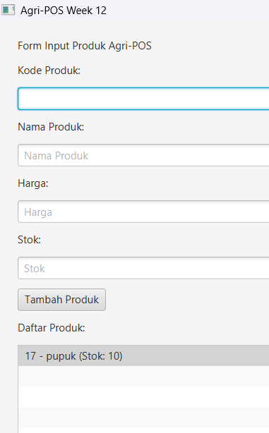

# Laporan Praktikum week12
Topik:GUI Dasar JavaFX (Event-Driven Programming)

## Identitas
- Nama  : [Muhammad Firly Ramadhan]
- NIM   : [240202872]
- Kelas : [3IKRB]

---

## Tujuan
1. Menjelaskan konsep event-driven programming.
2. Membangun antarmuka grafis sederhana menggunakan JavaFX.
3. Membuat form input data produk.
4. Menampilkan daftar produk pada GUI.
5. Mengintegrasikan GUI dengan modul backend yang telah dibuat (DAO & Service).

---

## Dasar Teori
1. Model-View-Controller (MVC): Pola arsitektur ini memisahkan aplikasi menjadi tiga komponen utama untuk membedakan antara logika data (Model), tampilan antarmuka (View), dan pemroses input (Controller).
2. Event-Driven Programming: Paradigma ini mengatur alur program berdasarkan tindakan pengguna, seperti mengeklik tombol "Tambah Produk" yang memicu handler untuk memproses data.
3. Dependency Inversion Principle (DIP): Prinsip ini memastikan tingkat tinggi (View) tidak bergantung langsung pada tingkat rendah (DAO), melainkan melalui perantara berupa Service Layer.
4. JavaFX Scene Graph: JavaFX menggunakan struktur hierarki pohon (Scene Graph) untuk menyusun komponen visual seperti Button dan ListView di dalam jendela aplikasi (Stage).
5. Database Integration: Integrasi ini memungkinkan data yang diinput melalui antarmuka grafis disimpan secara permanen ke dalam sistem database PostgreSQL menggunakan driver JDBC.

---

## Langkah Praktikum
1. Persiapan Lingkungan: Mengunduh JavaFX SDK dan mendaftarkan library tersebut serta driver PostgreSQL ke dalam Referenced Libraries di VS Code.
2. Konfigurasi Run: Mengatur file launch.json dengan menambahkan vmArgs yang berisi path modul JavaFX agar aplikasi dapat dijalankan dengan benar.
3. Sinkronisasi Kode: Menyalin file Model, DAO, dan Service dari Bab 11 ke dalam struktur folder proyek baru serta memastikan seluruh deklarasi package sudah benar.
4. Pembuatan View: Menyusun antarmuka pengguna menggunakan komponen JavaFX seperti TextField untuk input, Button untuk aksi, dan ListView untuk menampilkan daftar produk.
5. Implementasi Controller: Membuat kelas Controller sebagai perantara untuk menghubungkan aksi dari View ke logika bisnis di Service Layer.
6. Koneksi Database: Melakukan inisialisasi koneksi JDBC di kelas utama (AppJavaFX) menggunakan kredensial PostgreSQL yang sesuai agar data dapat tersimpan secara permanen.
7. Pengujian Aplikasi: Menjalankan aplikasi untuk memastikan data produk (seperti pupuk dan benih) muncul di daftar dan tombol "Tambah" berhasil menyimpan data baru ke database.

---

## Kode Program
##controller
```java
package com.upb.agripos.controller;

import com.upb.agripos.model.Product;
import com.upb.agripos.service.ProductService;
import java.util.List; // Penting: Menghilangkan error 'List cannot be resolved'
import java.util.ArrayList;

public class ProductController {
    private ProductService service;

    public ProductController(ProductService service) {
        this.service = service;
    }

    // Fungsi untuk menambah produk
    public void addProduct(String code, String name, String price, String stock) {
        try {
            double p = Double.parseDouble(price);
            int s = Integer.parseInt(stock);
            Product product = new Product(code, name, p, s);
            service.addProduct(product); // Mengirim ke service
        } catch (Exception e) {
            e.printStackTrace();
        }
    }

    // Fungsi untuk mengambil daftar produk agar muncul di ListView
    public List<Product> getAllProducts() {
        try {
            return service.findAll(); // Memanggil service sesuai alur MVC
        } catch (Exception e) {
            e.printStackTrace();
            return new ArrayList<>();
        }
    }
}
```
##Productdao
```java
package com.upb.agripos.dao;

import java.util.List;
import com.upb.agripos.model.Product;

public interface ProductDAO {
    void insert(Product product) throws Exception;
    Product findByCode(String code) throws Exception;
    List<Product> findAll() throws Exception;
    void update(Product product) throws Exception;
    void delete(String code) throws Exception;
}
```
##productdaoimpl
```java
package com.upb.agripos.dao;

import java.sql.*;
import java.util.ArrayList;
import java.util.List;
import com.upb.agripos.model.Product;

public class ProductDAOImpl implements ProductDAO {
    private final Connection connection;

    public ProductDAOImpl(Connection connection) {
        this.connection = connection;
    }

    @Override
    public void insert(Product p) throws Exception {
        String sql = "INSERT INTO products(code, name, price, stock) VALUES (?, ?, ?, ?)";
        try (PreparedStatement ps = connection.prepareStatement(sql)) {
            ps.setString(1, p.getCode());
            ps.setString(2, p.getName());
            ps.setDouble(3, p.getPrice());
            ps.setInt(4, p.getStock());
            ps.executeUpdate();
        }
    }

    @Override
    public Product findByCode(String code) throws Exception {
        String sql = "SELECT * FROM products WHERE code = ?";
        try (PreparedStatement ps = connection.prepareStatement(sql)) {
            ps.setString(1, code);
            try (ResultSet rs = ps.executeQuery()) {
                if (rs.next()) {
                    return new Product(
                        rs.getString("code"),
                        rs.getString("name"),
                        rs.getDouble("price"),
                        rs.getInt("stock")
                    );
                }
            }
        }
        return null;
    }

    @Override
    public List<Product> findAll() throws Exception {
        List<Product> list = new ArrayList<>();
        String sql = "SELECT * FROM products";
        try (PreparedStatement ps = connection.prepareStatement(sql);
             ResultSet rs = ps.executeQuery()) {
            while (rs.next()) {
                list.add(new Product(
                    rs.getString("code"),
                    rs.getString("name"),
                    rs.getDouble("price"),
                    rs.getInt("stock")
                ));
            }
        }
        return list;
    }

    @Override
    public void update(Product p) throws Exception {
        String sql = "UPDATE products SET name=?, price=?, stock=? WHERE code=?";
        try (PreparedStatement ps = connection.prepareStatement(sql)) {
            ps.setString(1, p.getName());
            ps.setDouble(2, p.getPrice());
            ps.setInt(3, p.getStock());
            ps.setString(4, p.getCode());
            ps.executeUpdate();
        }
    }

    @Override
    public void delete(String code) throws Exception {
        String sql = "DELETE FROM products WHERE code=?";
        try (PreparedStatement ps = connection.prepareStatement(sql)) {
            ps.setString(1, code);
            ps.executeUpdate();
        }
    }
}
```
##product
```java
package com.upb.agripos.model;

public class Product {
    private String code;
    private String name;
    private double price;
    private int stock;

    public Product(String code, String name, double price, int stock) {
        this.code = code;
        this.name = name;
        this.price = price;
        this.stock = stock;
    }

    public String getCode() { return code; }
    public String getName() { return name; }
    public double getPrice() { return price; }
    public int getStock() { return stock; }

    public void setCode(String code) { this.code = code; }
    public void setName(String name) { this.name = name; }
    public void setPrice(double price) { this.price = price; }
    public void setStock(int stock) { this.stock = stock; }
}
```
##Service
```java
package com.upb.agripos.service;

import com.upb.agripos.dao.ProductDAO;
import com.upb.agripos.model.Product;
import java.util.List;

public class ProductService {
    private ProductDAO dao;

    public ProductService(ProductDAO dao) {
        this.dao = dao;
    }

    public void insert(Product p) throws Exception {
        dao.insert(p);
    }

    public List<Product> findAll() throws Exception {
        return dao.findAll();
    }
}
```
##Productfromview
```java
package com.upb.agripos.view;

import com.upb.agripos.controller.ProductController;
import com.upb.agripos.model.Product;
import javafx.geometry.Insets;
import javafx.scene.Parent;
import javafx.scene.control.*;
import javafx.scene.layout.VBox;

public class ProductFormView {
    private VBox root;
    private TextField txtCode, txtName, txtPrice, txtStock;
    private Button btnAdd;
    private ListView<String> listView; // Ini komponen daftar produknya
    private ProductController controller;

    public ProductFormView(ProductController controller) {
        this.controller = controller;
        initUI();
    }

    private void initUI() {
        root = new VBox(10); // Susun secara vertikal dengan jarak 10px
        root.setPadding(new Insets(20));

        txtCode = new TextField(); txtCode.setPromptText("Kode Produk");
        txtName = new TextField(); txtName.setPromptText("Nama Produk");
        txtPrice = new TextField(); txtPrice.setPromptText("Harga");
        txtStock = new TextField(); txtStock.setPromptText("Stok");
        btnAdd = new Button("Tambah Produk");
        listView = new ListView<>(); // Inisialisasi kotak daftar

        // Tambahkan semua komponen ke dalam layar
        root.getChildren().addAll(
            new Label("Form Input Produk Agri-POS"),
            new Label("Kode Produk:"), txtCode,
            new Label("Nama Produk:"), txtName,
            new Label("Harga:"), txtPrice,
            new Label("Stok:"), txtStock,
            btnAdd,
            new Label("Daftar Produk:"), listView
        );

        // Ambil data dari database saat aplikasi baru dibuka
        refreshTable();

        // Aksi ketika tombol diklik
        btnAdd.setOnAction(event -> {
            controller.addProduct(txtCode.getText(), txtName.getText(), txtPrice.getText(), txtStock.getText());
            refreshTable(); // Update daftar setelah simpan ke DB
            clearFields();
        });
    }

    // Fungsi untuk mengambil data terbaru dari database
    private void refreshTable() {
        listView.getItems().clear();
        for (Product p : controller.getAllProducts()) {
            listView.getItems().add(p.getCode() + " - " + p.getName() + " (Stok: " + p.getStock() + ")");
        }
    }

    private void clearFields() {
        txtCode.clear(); txtName.clear(); txtPrice.clear(); txtStock.clear();
    }

    public Parent asParent() { return root; }
}
```
##APPJavaFX
```java
package com.upb.agripos;

import javafx.application.Application;
import javafx.scene.Scene;
import javafx.stage.Stage;
import com.upb.agripos.dao.ProductDAOImpl;
import com.upb.agripos.service.ProductService;
import com.upb.agripos.controller.ProductController;
import com.upb.agripos.view.ProductFormView;
import java.sql.Connection;
import java.sql.DriverManager;

public class AppJavaFX extends Application {
    @Override
    public void start(Stage primaryStage) throws Exception {
        // Setup Database (Gunakan password Anda dari Bab 11)
        Connection conn = DriverManager.getConnection("jdbc:postgresql://localhost:5432/agripos", "postgres", "admin321");
        
        // Inisialisasi MVC
        ProductDAOImpl dao = new ProductDAOImpl(conn);
        ProductService service = new ProductService(dao);
        ProductController controller = new ProductController(service);
        ProductFormView view = new ProductFormView(controller);

        primaryStage.setTitle("Agri-POS Week 12");
        primaryStage.setScene(new Scene(view.asParent(), 350, 300));
        primaryStage.show();
    }

    public static void main(String[] args) {
        launch(args);
    }
}
```
---

## Hasil Eksekusi  


---

## Analisis
- Integrasi Arsitektur: Aplikasi berhasil menerapkan pemisahan tanggung jawab (separation of concerns) di mana GUI (View) hanya menangani tampilan, sementara logika data dikelola oleh ProductService dan ProductDAO.
- Konektivitas Database: Penggunaan driver JDBC PostgreSQL memungkinkan aplikasi melakukan sinkronisasi data secara real-time antara antarmuka JavaFX dan tabel database agripos.
- Mekanisme Event-Handling: Implementasi tombol "Tambah Produk" membuktikan bahwa skema Event-Driven dapat memicu rangkaian proses dari penangkapan input teks hingga eksekusi perintah SQL INSERT.
- Validasi Traceability: Fungsi penambahan dan penampilan daftar produk (seperti pupuk dan benih) telah terverifikasi konsisten dengan artefak desain Sequence Diagram dan Activity Diagram dari Bab 6.
- Efektivitas UI: Penggunaan komponen ListView memberikan umpan balik visual yang instan kepada pengguna setelah data berhasil disimpan, sehingga meningkatkan aspek usability aplikasi.
- Manajemen Dependency: Penggunaan vmArgs di launch.json sangat krusial untuk memuat modul JavaFX (javafx.controls) secara dinamis saat runtime agar aplikasi tidak mengalami FindException.
---

## Kesimpulan
Praktikum ini berhasil membangun aplikasi GUI berbasis JavaFX yang terintegrasi penuh dengan database PostgreSQL melalui pola arsitektur MVC. Penggunaan komponen dinamis seperti ListView mempermudah pengguna dalam memantau daftar produk secara langsung dari database. Keberhasilan aplikasi dalam menjalankan skenario tambah produk membuktikan bahwa implementasi kode telah memenuhi aspek traceability terhadap rancangan desain sistem yang telah dibuat sebelumnya.

---
