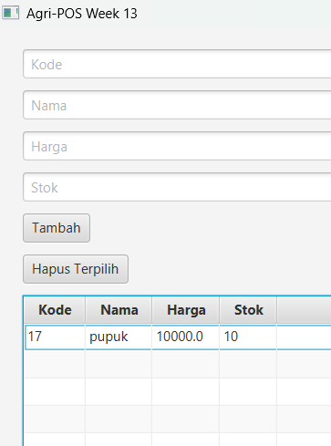

# Laporan Praktikum week13
Topik:GUI Lanjutan JavaFX (TableView dan Lambda Expression)

## Identitas
- Nama  : [Muhammad Firly Ramadhan]
- NIM   : [240202872]
- Kelas : [3IKRB]

---

## Tujuan
1. Menampilkan data menggunakan TableView JavaFX.
2. Mengintegrasikan koleksi objek dengan GUI.
3. Menggunakan lambda expression untuk event handling.
4. Menghubungkan GUI dengan DAO secara penuh.
5. Membangun antarmuka GUI Agri-POS yang lebih interaktif.
---

## Dasar Teori
1. TableView Control: TableView adalah komponen JavaFX yang berfungsi menampilkan data secara terstruktur dalam format baris dan kolom yang lebih profesional dibanding ListView.

2. TableColumn & PropertyValueFactory: Kolom tabel didefinisikan melalui TableColumn dan dihubungkan secara otomatis ke variabel di class Model menggunakan PropertyValueFactory.

3. Lambda Expression: Lambda Expression merupakan fitur Java untuk menulis blok kode penanganan event (seperti klik tombol) secara lebih ringkas dan efisien tanpa perlu mendeklarasikan class anonim yang panjang.

4. Arsitektur MVC Terintegrasi: Pengembangan ini menerapkan pola Model-View-Controller untuk memisahkan logika tampilan tabel, pemrosesan data, dan akses database.

5. Traceability: Prinsip traceability digunakan untuk memastikan setiap elemen antarmuka (View) memiliki keterkaitan yang jelas dengan logika bisnis di Service dan eksekusi Query di DAO.

---

## Langkah Praktikum
1. Persiapan Struktur Folder: Membuat folder baru week13-gui-lanjutan di dalam direktori praktikum dan menyalin seluruh file sumber (src) dari Week 12 sebagai dasar pengembangan.

2. Konfigurasi Environment: Mendaftarkan folder src/main/java sebagai Source Path di VS Code dan menambahkan library JavaFX serta driver PostgreSQL ke dalam Referenced Libraries untuk mengatasi error "NoClassDefFoundError".

3. Modifikasi View (TableView): Mengubah komponen ListView pada ProductFormView.java menjadi TableView serta mendefinisikan TableColumn untuk Kode, Nama, Harga, dan Stok menggunakan PropertyValueFactory.

4. Implementasi Fitur Hapus: Menambahkan tombol "Hapus Terpilih" dan menerapkan Lambda Expression pada setOnAction untuk menangkap baris data yang dipilih dan mengirimkan kodenya ke Controller.

5. Pembaruan Controller dan Service: Menambahkan method deleteProduct(String code) pada ProductController dan ProductService untuk menghubungkan antarmuka pengguna dengan lapisan logika bisnis.

6. Eksekusi Query DAO: Mengimplementasikan method delete pada ProductDAOImpl menggunakan PreparedStatement dengan perintah SQL DELETE FROM produk WHERE kode = ? untuk penghapusan permanen di database PostgreSQL.

7. Penanganan Exception: Menambahkan blok try-catch di tingkat Controller untuk menangani Unhandled exception type Exception guna memastikan aplikasi tidak berhenti secara tiba-tiba jika terjadi kesalahan database.

---

## Kode Program
##controller
```java
package com.upb.agripos.controller;

import com.upb.agripos.model.Product;
import com.upb.agripos.service.ProductService;
import java.util.ArrayList;
import java.util.List;

public class ProductController {
    private ProductService service;

    public ProductController(ProductService service) {
        this.service = service;
    }

    // Menangani error 'Unhandled exception type Exception'
    public List<Product> getAllProducts() {
        try {
            return service.getAllProducts();
        } catch (Exception e) {
            System.err.println("Gagal mengambil data: " + e.getMessage());
            return new ArrayList<>(); // Kembalikan list kosong agar UI tidak crash
        }
    }

    public void addProduct(String code, String name, String price, String stock) {
        try {
            // Konversi input dari View (String) ke tipe data Model
            double pPrice = Double.parseDouble(price);
            int pStock = Integer.parseInt(stock);
            
            Product p = new Product(code, name, pPrice, pStock);
            service.addProduct(p);
        } catch (NumberFormatException e) {
            System.err.println("Format angka salah: " + e.getMessage());
        } catch (Exception e) {
            e.printStackTrace();
        }
    }

    // Method Hapus menggunakan String Code agar sinkron dengan View
    public void deleteProduct(String code) {
        try {
            service.deleteProduct(code);
        } catch (Exception e) {
            System.err.println("Gagal menghapus produk: " + e.getMessage());
            e.printStackTrace();
        }
    }
}
```
##Productdao
```java
package com.upb.agripos.dao;

import java.util.List;
import com.upb.agripos.model.Product;

public interface ProductDAO {
    void insert(Product product) throws Exception;
    Product findByCode(String code) throws Exception;
    List<Product> findAll() throws Exception;
    void update(Product product) throws Exception;
    void delete(String code) throws Exception;
}
```
##productdaoimpl
```java
package com.upb.agripos.dao;

import java.sql.*;
import java.util.ArrayList;
import java.util.List;
import com.upb.agripos.model.Product;

public class ProductDAOImpl implements ProductDAO {
    private final Connection connection;

    public ProductDAOImpl(Connection connection) {
        this.connection = connection;
    }

    @Override
    public void insert(Product p) throws Exception {
        String sql = "INSERT INTO products(code, name, price, stock) VALUES (?, ?, ?, ?)";
        try (PreparedStatement ps = connection.prepareStatement(sql)) {
            ps.setString(1, p.getCode());
            ps.setString(2, p.getName());
            ps.setDouble(3, p.getPrice());
            ps.setInt(4, p.getStock());
            ps.executeUpdate();
        }
    }

    @Override
    public Product findByCode(String code) throws Exception {
        String sql = "SELECT * FROM products WHERE code = ?";
        try (PreparedStatement ps = connection.prepareStatement(sql)) {
            ps.setString(1, code);
            try (ResultSet rs = ps.executeQuery()) {
                if (rs.next()) {
                    return new Product(
                        rs.getString("code"),
                        rs.getString("name"),
                        rs.getDouble("price"),
                        rs.getInt("stock")
                    );
                }
            }
        }
        return null;
    }

    @Override
    public List<Product> findAll() throws Exception {
        List<Product> list = new ArrayList<>();
        String sql = "SELECT * FROM products";
        try (PreparedStatement ps = connection.prepareStatement(sql);
             ResultSet rs = ps.executeQuery()) {
            while (rs.next()) {
                list.add(new Product(
                    rs.getString("code"),
                    rs.getString("name"),
                    rs.getDouble("price"),
                    rs.getInt("stock")
                ));
            }
        }
        return list;
    }

    @Override
    public void update(Product p) throws Exception {
        String sql = "UPDATE products SET name=?, price=?, stock=? WHERE code=?";
        try (PreparedStatement ps = connection.prepareStatement(sql)) {
            ps.setString(1, p.getName());
            ps.setDouble(2, p.getPrice());
            ps.setInt(3, p.getStock());
            ps.setString(4, p.getCode());
            ps.executeUpdate();
        }
    }

    @Override
    public void delete(String code) throws Exception {
        String sql = "DELETE FROM products WHERE code=?";
        try (PreparedStatement ps = connection.prepareStatement(sql)) {
            ps.setString(1, code);
            ps.executeUpdate();
        }
    }
}
```
##product
```java
package com.upb.agripos.model;

public class Product {
    private String code;
    private String name;
    private double price;
    private int stock;

    public Product(String code, String name, double price, int stock) {
        this.code = code;
        this.name = name;
        this.price = price;
        this.stock = stock;
    }

    public String getCode() { return code; }
    public String getName() { return name; }
    public double getPrice() { return price; }
    public int getStock() { return stock; }

    public void setCode(String code) { this.code = code; }
    public void setName(String name) { this.name = name; }
    public void setPrice(double price) { this.price = price; }
    public void setStock(int stock) { this.stock = stock; }
}
```
##Service
```java
package com.upb.agripos.service;

import com.upb.agripos.dao.ProductDAO;
import com.upb.agripos.model.Product;
import java.util.List;

public class ProductService {
    private ProductDAO productDAO;

    public ProductService(ProductDAO productDAO) {
        this.productDAO = productDAO;
    }

    public List<Product> getAllProducts() throws Exception {
        return productDAO.findAll();
    }

    public void addProduct(Product p) throws Exception {
        productDAO.insert(p);
    }

    public void deleteProduct(String code) throws Exception {
        ProductDAO.delete(code); // Memanggil DAO untuk eksekusi SQL
    }
}
```
##Productfromview
```java
package com.upb.agripos.view;

import com.upb.agripos.controller.ProductController;
import com.upb.agripos.model.Product;
import javafx.collections.FXCollections;
import javafx.geometry.Insets;
import javafx.scene.Parent;
import javafx.scene.control.*;
import javafx.scene.control.cell.PropertyValueFactory;
import javafx.scene.layout.VBox;

public class ProductFormView {
    private VBox root;
    private TableView<Product> table;
    private TextField txtCode, txtName, txtPrice, txtStock;
    private ProductController controller;

    public ProductFormView(ProductController controller) {
        this.controller = controller;
        initUI();
    }

    @SuppressWarnings("unchecked")
    private void initUI() {
        root = new VBox(10);
        root.setPadding(new Insets(20));

        txtCode = new TextField(); txtCode.setPromptText("Kode");
        txtName = new TextField(); txtName.setPromptText("Nama");
        txtPrice = new TextField(); txtPrice.setPromptText("Harga");
        txtStock = new TextField(); txtStock.setPromptText("Stok");

        // Konfigurasi Tabel
        table = new TableView<>();
        TableColumn<Product, String> colCode = new TableColumn<>("Kode");
        colCode.setCellValueFactory(new PropertyValueFactory<>("code"));
        
        TableColumn<Product, String> colName = new TableColumn<>("Nama");
        colName.setCellValueFactory(new PropertyValueFactory<>("name"));

        TableColumn<Product, Double> colPrice = new TableColumn<>("Harga");
        colPrice.setCellValueFactory(new PropertyValueFactory<>("price"));

        TableColumn<Product, Integer> colStock = new TableColumn<>("Stok");
        colStock.setCellValueFactory(new PropertyValueFactory<>("stock"));
        
        table.getColumns().addAll(colCode, colName, colPrice, colStock);

        Button btnAdd = new Button("Tambah");
        btnAdd.setOnAction(e -> {
            controller.addProduct(txtCode.getText(), txtName.getText(), txtPrice.getText(), txtStock.getText());
            loadData();
        });

        // Tombol Hapus dengan Lambda
        Button btnDelete = new Button("Hapus Terpilih");
        btnDelete.setOnAction(e -> {
            Product selected = table.getSelectionModel().getSelectedItem();
            if (selected != null) {
                controller.deleteProduct(selected.getCode()); // Kirim String Code
                loadData();
            }
        });

        root.getChildren().addAll(txtCode, txtName, txtPrice, txtStock, btnAdd, btnDelete, table);
        loadData();
    }

    private void loadData() {
        table.setItems(FXCollections.observableArrayList(controller.getAllProducts()));
    }

    public Parent asParent() { return root; }
}
```
##APPJavaFX
```java
package com.upb.agripos;

import javafx.application.Application;
import javafx.scene.Scene;
import javafx.stage.Stage;
import com.upb.agripos.dao.ProductDAOImpl;
import com.upb.agripos.service.ProductService;
import com.upb.agripos.controller.ProductController;
import com.upb.agripos.view.ProductFormView;
import java.sql.Connection;
import java.sql.DriverManager;

public class AppJavaFX extends Application {
    @Override
    public void start(Stage primaryStage) throws Exception {
     
        Connection conn = DriverManager.getConnection("jdbc:postgresql://localhost:5432/agripos", "postgres", "admin321");
        
        // Inisialisasi MVC
        ProductDAOImpl dao = new ProductDAOImpl(conn);
        ProductService service = new ProductService(dao);
        ProductController controller = new ProductController(service);
        ProductFormView view = new ProductFormView(controller);

        primaryStage.setTitle("Agri-POS Week 13");
        primaryStage.setScene(new Scene(view.asParent(), 350, 300));
        primaryStage.show();
    }

    public static void main(String[] args) {
        launch(args);
    }
}
```
---

## Hasil Eksekusi



---

## Analisis

1. Jelaskan bagaimana program berjalan!
   Aplikasi ini berjalan dengan mengawali inisialisasi pada class AppJavaFX yang membangun jendela utama dan menghubungkan seluruh lapisan Model-View-Controller (MVC) melalui mekanisme Dependency Injection. Saat aplikasi terbuka, ProductFormView secara otomatis memanggil fungsi loadData() untuk menarik data dari database PostgreSQL melalui ProductDAO dan menampilkannya pada TableView menggunakan PropertyValueFactory. Ketika pengguna memilih baris dan mengklik tombol hapus, Lambda Expression menangkap data terpilih dan meneruskannya ke ProductController untuk dieksekusi oleh perintah SQL DELETE secara permanen, yang kemudian diakhiri dengan pembaruan tampilan tabel secara real-time.

2. Apa perbedaan dengan minggu sebelumnya?
   Perbedaan utama praktikum ini dengan minggu lalu terletak pada penggunaan komponen TableView yang menyajikan data dalam kolom terstruktur, menggantikan ListView yang hanya berupa daftar teks satu dimensi. Selain itu, penulisan kode menjadi lebih ringkas melalui implementasi Lambda Expression untuk menangani klik tombol dan PropertyValueFactory untuk menghubungkan data model ke tabel secara otomatis. Praktikum kali ini juga melengkapi fitur aplikasi dengan menambahkan fungsi Hapus Produk yang terintegrasi langsung dari antarmuka hingga ke database PostgreSQL.

3. Apa kendala yang dialami?
   Kendala utama yang dialami adalah terjadinya runtime error akibat ketidaksesuaian tipe data (mismatch) antara String yang dikirim dari View dengan objek Product yang diharapkan oleh Controller pada fitur hapus produk. Selain itu, sempat muncul kesalahan kompilasi berupa unhandled exception karena pemanggilan method database pada ProductController belum dibungkus dalam blok try-catch. Hambatan teknis lainnya adalah hilangnya kolom harga dan stok pada tabel yang disebabkan oleh belum terkonfigurasinya TableColumn dan PropertyValueFactory secara lengkap di dalam kode antarmuka.

## Kesimpulan
Praktikum ini berhasil membuktikan bahwa implementasi TableView dan Lambda Expression pada JavaFX meningkatkan kualitas antarmuka serta efisiensi kode program, di mana setiap aksi pengguna pada GUI telah terhubung secara akurat ke database PostgreSQL sesuai prinsip traceability dan desain Model-View-Controller.

---

