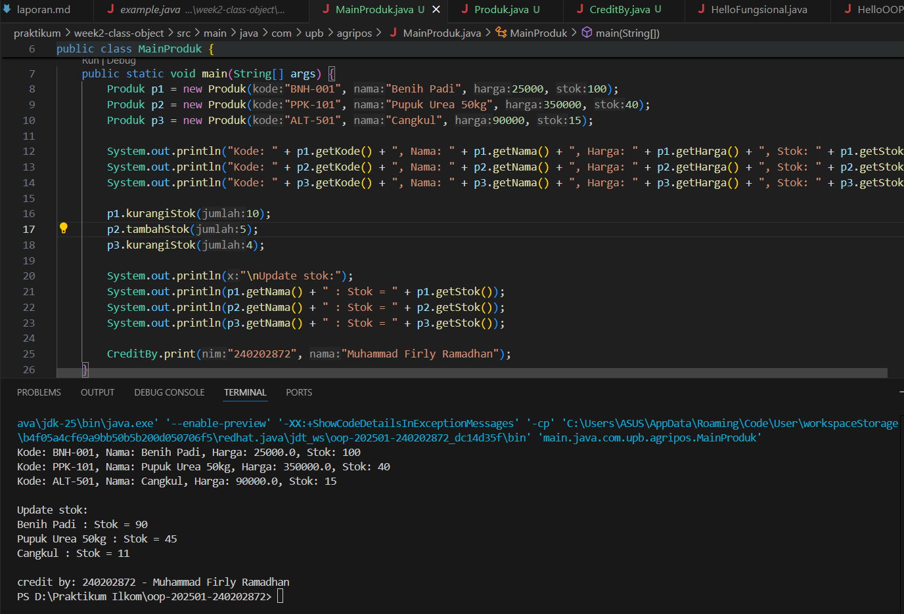

# Laporan Praktikum Minggu 2
Topik: ["Class dan Object"]

## Identitas
- Nama  : [Muhammad Firly Ramadhan]
- NIM   : [240202872]
- Kelas : [3IKRB]

---

## Tujuan
1. Memahami konsep *class* dan *object* dalam OOP.
2. Mampu menerapkan *enkapsulasi* dengan *getter* dan *setter*.
3. Dapat membuat class `Produk` untuk merepresentasikan produk pertanian.
4. Mampu menampilkan identitas mahasiswa melalui class `CreditBy`.

---

## Dasar Teori
1. **Class** adalah blueprint atau cetak biru dari objek.
2. **Object** merupakan instansiasi dari class dan memiliki atribut serta method.
3. **Enkapsulasi** melindungi data dengan menjadikan atribut `private` dan mengaksesnya melalui `getter` dan `setter`.
4. **Access modifier** (`public`, `private`, `protected`) mengatur visibilitas data dan method dalam OOP.
5. Dengan class, kode menjadi lebih modular, mudah dikembangkan, dan dapat digunakan ulang.

---

## Langkah Praktikum
1. Membuat folder project `week2-class-object` di dalam repository.
2. Membuat class `Produk` pada package `com.upb.agripos.model` dengan atribut `kode`, `nama`, `harga`, dan `stok`.
3. Membuat class `CreditBy` pada package `com.upb.agripos.util` untuk menampilkan identitas mahasiswa.
4. Membuat file `MainProduk.java` untuk menampilkan data tiga produk pertanian dan memanggil `CreditBy.print()`.
5. Menjalankan program dan memverifikasi hasil output di console.
6. Melakukan commit dengan pesan:

   ```
   TugasWeek2
   ```

## Kode Program
## 1. Produk.java
``` Produk.java
package main.java.com.upb.agripos.model;

public class Produk {
    private String kode;
    private String nama;
    private double harga;
    private int stok;

    public Produk(String kode, String nama, double harga, int stok) {
        this.kode = kode;
        this.nama = nama;
        this.harga = harga;
        this.stok = stok;
    }

    public String getKode() { return kode; }
    public void setKode(String kode) { this.kode = kode; }

    public String getNama() { return nama; }
    public void setNama(String nama) { this.nama = nama; }

    public double getHarga() { return harga; }
    public void setHarga(double harga) { this.harga = harga; }

    public int getStok() { return stok; }
    public void setStok(int stok) { this.stok = stok; }

    public void tambahStok(int jumlah) {
        this.stok += jumlah;
    }

    public void kurangiStok(int jumlah) {
        if (this.stok >= jumlah) {
            this.stok -= jumlah;
        } else {
            System.out.println("Stok tidak mencukupi!");
        }
    }
}
```
2. CreditBy.java
```CreditBy.java
package main.java.com.upb.agripos.util;


public class CreditBy {
    public static void print(String nim, String nama) {
        System.out.println("\ncredit by: " + nim + " - " + nama);
    }
}
```
3. MainProduk.java
```MainProduk.java
package main.java.com.upb.agripos;

import main.java.com.upb.agripos.model.Produk;
import main.java.com.upb.agripos.util.CreditBy;

public class MainProduk {
    public static void main(String[] args) {
        Produk p1 = new Produk("BNH-001", "Benih Padi", 25000, 100);
        Produk p2 = new Produk("PPK-101", "Pupuk Urea 50kg", 350000, 40);
        Produk p3 = new Produk("ALT-501", "Cangkul", 90000, 15);

        System.out.println("Kode: " + p1.getKode() + ", Nama: " + p1.getNama() + ", Harga: " + p1.getHarga() + ", Stok: " + p1.getStok());
        System.out.println("Kode: " + p2.getKode() + ", Nama: " + p2.getNama() + ", Harga: " + p2.getHarga() + ", Stok: " + p2.getStok());
        System.out.println("Kode: " + p3.getKode() + ", Nama: " + p3.getNama() + ", Harga: " + p3.getHarga() + ", Stok: " + p3.getStok());

        p1.kurangiStok(10);
        p2.tambahStok(5);
        p3.kurangiStok(4);

        System.out.println("\nUpdate stok:");
        System.out.println(p1.getNama() + " : Stok = " + p1.getStok());
        System.out.println(p2.getNama() + " : Stok = " + p2.getStok());
        System.out.println(p3.getNama() + " : Stok = " + p3.getStok());

        CreditBy.print("240202872", "Muhammad Firly Ramadhan");
    }
}
```

## Hasil Eksekusi


---

## Analisis
1. Program menerapkan konsep OOP dengan baik: class `Produk` mewakili objek produk dengan atribut dan method.
2. Enkapsulasi diterapkan melalui atribut `private` dan penggunaan *getter/setter*.
3. Method `tambahStok()` dan `kurangiStok()` menunjukkan perilaku (behavior) objek.
4. Pemanggilan `CreditBy.print()` menampilkan identitas mahasiswa secara otomatis.
5. Dibanding minggu sebelumnya, pendekatan OOP membuat program lebih terstruktur dan mudah dikembangkan.
6. Kendala yang dihadapi: Kendala yang dihadapi: sempat terjadi kesalahan saat mendefinisikan constructor (urutan parameter tidak sesuai) dan kesalahan dalam menampilkan semua produk karena lupa memanggil produk ketiga. Setelah diperbaiki, program berjalan sesuai harapan.
---

## Kesimpulan
Dengan menerapkan konsep *class* dan *object*, program menjadi lebih modular, mudah dipahami, dan dapat dikembangkan untuk sistem Agri-POS yang lebih besar.
Konsep enkapsulasi membantu menjaga keamanan data dan konsistensi nilai atribut.
---

## Quiz
(1. Mengapa atribut sebaiknya dideklarasikan sebagai private dalam class?
   **Jawaban:Atribut sebaiknya dideklarasikan sebagai private agar data di dalam class tidak bisa diakses atau diubah langsung dari luar class.
Hal ini melindungi integritas data dan mencegah perubahan yang tidak diinginkan. Dengan cara ini, programmer dapat mengontrol bagaimana data dibaca dan dimodifikasi melalui method getter dan setter.** …  

2. Apa fungsi getter dan setter dalam enkapsulasi? 
   **Jawaban:Getter berfungsi untuk mengambil (membaca) nilai atribut yang bersifat private. Setter berfungsi untuk mengubah (menulis) nilai atribut tersebut dengan kontrol tertentu (misalnya memvalidasi input). Keduanya mendukung konsep enkapsulasi dengan memberikan akses terkontrol terhadap atribut internal suatu objek.** …  

3. Bagaimana cara class Produk mendukung pengembangan aplikasi POS yang lebih kompleks?
   **Jawaban:Class Produk dapat menjadi dasar model data untuk sistem POS (Point of Sale).
Dengan adanya class ini, sistem dapat:
a. Mengelola daftar produk secara terstruktur (nama, harga, stok).
b. Digunakan kembali untuk fitur lanjutan seperti transaksi, laporan stok, dan manajemen inventori.
c. Mudah dikembangkan karena desain berbasis OOP memungkinkan penambahan fitur tanpa mengubah struktur dasar class.** …  )
