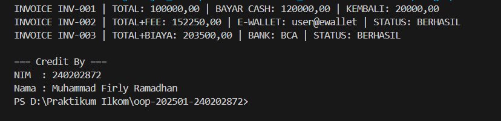

# Laporan Praktikum Minggu 5
Topik: AbstractionInterface

## Identitas
- Nama  : Muhammad Firly Ramadhan
- NIM   : 240202872
- Kelas : 3IKRB

---

## Tujuan
- Memahami konsep abstraksi dalam pemrograman berorientasi objek.
- Membedakan penggunaan abstract class dan interface di Java.
- Mendesain dan mengimplementasikan kelas abstrak Pembayaran.
- Membuat dan menerapkan interface Validatable dan Receiptable.
- Menerapkan konsep multiple inheritance dan polimorfisme dalam sistem pembayaran Agri-POS.
---

## Dasar Teori
1. Abstraksi (Abstraction) adalah proses menyembunyikan detail implementasi dan hanya menampilkan fitur penting dari suatu objek atau sistem.
2. Abstract Class adalah kelas yang tidak dapat diinstansiasi langsung dan dapat memiliki metode abstrak (tanpa isi) maupun metode konkrit (dengan isi).
3. Interface adalah kumpulan kontrak yang berisi deklarasi metode tanpa implementasi, yang harus diimplementasikan oleh kelas yang menggunakannya.
4. Java tidak mendukung multiple inheritance antar kelas, tetapi hal tersebut dapat dicapai melalui implementasi banyak interface.
5. Konsep polimorfisme memungkinkan objek dengan tipe induk (Pembayaran) mereferensikan berbagai objek turunan seperti Cash, EWallet, dan TransferBank.
---

## Langkah Praktikum
1. **Abstract Class – Pembayaran**
   - Buat `Pembayaran` (abstract) dengan field `invoiceNo`, `total` dan method:
     - `double biaya()` (abstrak) → biaya tambahan (fee).
     - `boolean prosesPembayaran()` (abstrak) → mengembalikan status berhasil/gagal.
     - `double totalBayar()` (konkrit) → `return total + biaya();`.

2. **Subclass Konkret**
   - `Cash` → biaya = 0, proses = selalu berhasil jika `tunai >= totalBayar()`.
   - `EWallet` → biaya = 1.5% dari `total`; proses = membutuhkan validasi.

3. **Interface**
   - `Validatable` → `boolean validasi();` (contoh: OTP).
   - `Receiptable` → `String cetakStruk();`

4. **Multiple Inheritance via Interface**
   - `EWallet` mengimplementasikan **dua interface**: `Validatable`, `Receiptable`.
   - `Cash` setidaknya mengimplementasikan `Receiptable`.

5. **Main Class**
    - Buat `MainAbstraction.java` untuk mendemonstrasikan pemakaian `Pembayaran` (polimorfik).
    - Tampilkan hasil proses dan struk. Di akhir, panggil `CreditBy.print("[NIM]", "[Nama]")`.

6. **Commit dan Push**
   - Commit dengan pesan: `week5-abstraction-interface`.
---

## Kode Program
1. Receiptable
```Receiptable.java
package com.upb.agripos.model.kontrak;

public interface Receiptable {
    String cetakStruk();
}
```
2. Validatable
```Validatable.java
package com.upb.agripos.model.kontrak;

public interface Validatable {
    boolean validasi();
}
```
3. Cash
```Cash.java
package com.upb.agripos.model.pembayaran;

import com.upb.agripos.model.kontrak.Receiptable;

public class Cash extends Pembayaran implements Receiptable {
    private double tunai;

    public Cash(String invoiceNo, double total, double tunai) {
        super(invoiceNo, total);
        this.tunai = tunai;
    }

    @Override
    public double biaya() {
        return 0.0;
    }

    @Override
    public boolean prosesPembayaran() {
        return tunai >= totalBayar();
    }

    @Override
    public String cetakStruk() {
        return String.format(
            "INVOICE %s | TOTAL: %.2f | BAYAR CASH: %.2f | KEMBALI: %.2f",
            invoiceNo, totalBayar(), tunai, Math.max(0, tunai - totalBayar())
        );
    }
}
```
4. EWallet
```EWallet.java
package com.upb.agripos.model.pembayaran;

import com.upb.agripos.model.kontrak.Validatable;
import com.upb.agripos.model.kontrak.Receiptable;

public class EWallet extends Pembayaran implements Validatable, Receiptable {
    private String akun;
    private String otp;

    public EWallet(String invoiceNo, double total, String akun, String otp) {
        super(invoiceNo, total);
        this.akun = akun;
        this.otp = otp;
    }

    @Override
    public double biaya() {
        return total * 0.015;
    }

    @Override
    public boolean validasi() {
        return otp != null && otp.matches("\\d{6}");
    }

    @Override
    public boolean prosesPembayaran() {
        return validasi();
    }

    @Override
    public String cetakStruk() {
        return String.format(
            "INVOICE %s | TOTAL+FEE: %.2f | E-WALLET: %s | STATUS: %s",
            invoiceNo, totalBayar(), akun, prosesPembayaran() ? "BERHASIL" : "GAGAL"
        );
    }
}
```
5. Pembayaran
```Pembayaran.java
package com.upb.agripos.model.pembayaran;

public abstract class Pembayaran {
    protected String invoiceNo;
    protected double total;

    public Pembayaran(String invoiceNo, double total) {
        this.invoiceNo = invoiceNo;
        this.total = total;
    }

    public abstract double biaya();
    public abstract boolean prosesPembayaran();

    public double totalBayar() {
        return total + biaya();
    }

    public String getInvoiceNo() { return invoiceNo; }
    public double getTotal() { return total; }
}
```
6. TransferBank
```TransferBank.java
package com.upb.agripos.model.pembayaran;

import com.upb.agripos.model.kontrak.Validatable;
import com.upb.agripos.model.kontrak.Receiptable;

public class TransferBank extends Pembayaran implements Validatable, Receiptable {
    private String bankTujuan;
    private String otp;

    public TransferBank(String invoiceNo, double total, String bankTujuan, String otp) {
        super(invoiceNo, total);
        this.bankTujuan = bankTujuan;
        this.otp = otp;
    }

    @Override
    public double biaya() {
        return 3500; // biaya tetap
    }

    @Override
    public boolean validasi() {
        return otp != null && otp.matches("\\d{6}");
    }

    @Override
    public boolean prosesPembayaran() {
        return validasi();
    }

    @Override
    public String cetakStruk() {
        return String.format(
            "INVOICE %s | TOTAL+BIAYA: %.2f | BANK: %s | STATUS: %s",
            invoiceNo, totalBayar(), bankTujuan, prosesPembayaran() ? "BERHASIL" : "GAGAL"
        );
    }
}
```
7. CreditBy
```CreditBy.java
package com.upb.agripos.util;

public class CreditBy {
    public static void print(String nim, String nama) {
        System.out.println("\n=== Credit By ===");
        System.out.println("NIM  : " + nim);
        System.out.println("Nama : " + nama);
    }
}
```
8. MainAbstraction
```MainAbstraction.java
package com.upb.agripos;

import com.upb.agripos.model.kontrak.*;
import com.upb.agripos.model.pembayaran.Cash;
import com.upb.agripos.model.pembayaran.EWallet;
import com.upb.agripos.model.pembayaran.Pembayaran;
import com.upb.agripos.model.pembayaran.TransferBank;
import com.upb.agripos.util.CreditBy;

public class MainAbstraction {
    public static void main(String[] args) {
        Pembayaran cash = new Cash("INV-001", 100000, 120000);
        Pembayaran ew = new EWallet("INV-002", 150000, "user@ewallet", "123456");
        Pembayaran tf = new TransferBank("INV-003", 200000, "BCA", "654321");

        System.out.println(((Receiptable) cash).cetakStruk());
        System.out.println(((Receiptable) ew).cetakStruk());
        System.out.println(((Receiptable) tf).cetakStruk());

        CreditBy.print("240202872", "Muhammad Firly Ramadhan");
    }
}
```

---

## Hasil Eksekusi 


---

## Analisis

- Jelaskan bagaimana kode berjalan.
   Program dimulai dari MainAbstraction, yang membuat objek Cash, EWallet, dan TransferBank bertipe Pembayaran. Setiap objek memanggil metode prosesPembayaran() dan cetakStruk() sesuai implementasinya. Hasilnya menampilkan status transaksi dan rincian struk pembayaran melalui penerapan polimorfisme dan interface.
- Apa perbedaan pendekatan minggu ini dibanding minggu sebelumnya.
   Minggu ini fokus pada abstraksi dan interface, bukan sekadar pewarisan tunggal seperti minggu sebelumnya. Jika sebelumnya hanya menggunakan inheritance antar kelas, kali ini ditambahkan abstract class untuk dasar umum dan interface untuk kemampuan tambahan seperti validasi dan pencetakan struk.
- Kendala yang dihadapi dan cara mengatasinya.  
   Kendala utama adalah struktur package dan error “package does not match” saat menjalankan program di VS Code. Masalah diatasi dengan menyesuaikan struktur folder sesuai deklarasi package, menandai src/main/java sebagai Java Source Path, dan membersihkan hasil kompilasi lama sebelum dijalankan ulang.

---

## Kesimpulan
Melalui praktikum ini, dipahami bahwa abstraksi membantu menyederhanakan desain program dengan memisahkan logika umum dan spesifik. Penggunaan abstract class dan interface memungkinkan penerapan multiple inheritance dan polimorfisme secara efisien. Struktur ini membuat kode lebih fleksibel, mudah diperluas, dan sesuai dengan prinsip Object-Oriented Programming (OOP).
---

## Quiz
1. [Jelaskan perbedaan konsep dan penggunaan abstract class dan interface.]  
   **Jawaban: Abstract class berisi kerangka dasar dengan atribut dan metode umum yang bisa diwariskan. Interface hanya berisi kontrak perilaku tanpa implementasi. Abstract class digunakan untuk kelas yang sejenis, sedangkan interface untuk kemampuan tambahan lintas kelas.**

2. [Mengapa multiple inheritance lebih aman dilakukan dengan interface pada Java?]  
   **Jawaban: Karena interface tidak menyimpan state atau implementasi, sehingga tidak terjadi konflik pewarisan. Kelas dapat mengimplementasikan banyak interface tanpa benturan antar metode atau atribut.** 

3. [Pada contoh Agri-POS, bagian mana yang paling tepat menjadi abstract class dan mana yang menjadi interface? Jelaskan alasannya.]  
   **Jawaban: Pada contoh Agri-POS, kelas Pembayaran paling tepat dijadikan abstract class karena memiliki atribut dan perilaku dasar yang sama untuk semua jenis pembayaran seperti invoiceNo, total, dan metode totalBayar(). Sementara itu, Validatable dan Receiptable lebih tepat dijadikan interface karena keduanya hanya berisi kontrak perilaku, yaitu kemampuan validasi dan pencetakan struk, yang dapat diterapkan oleh berbagai jenis pembayaran tanpa terikat pada satu hierarki kelas tertentu.** 
