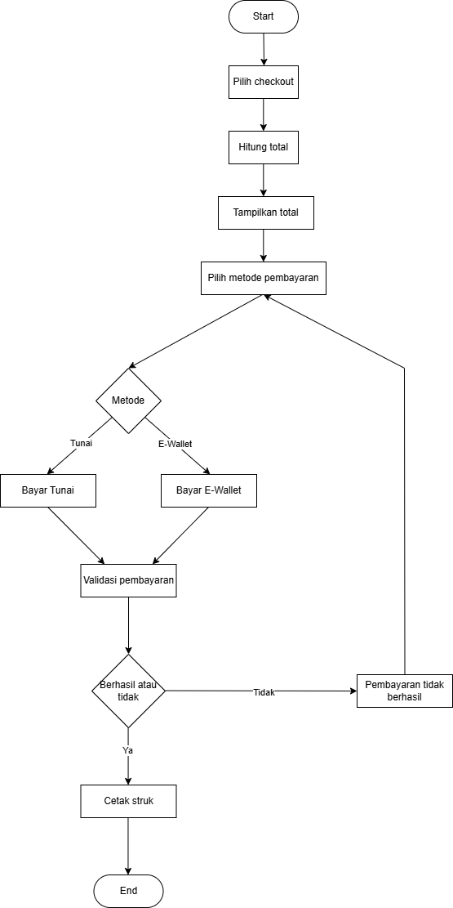
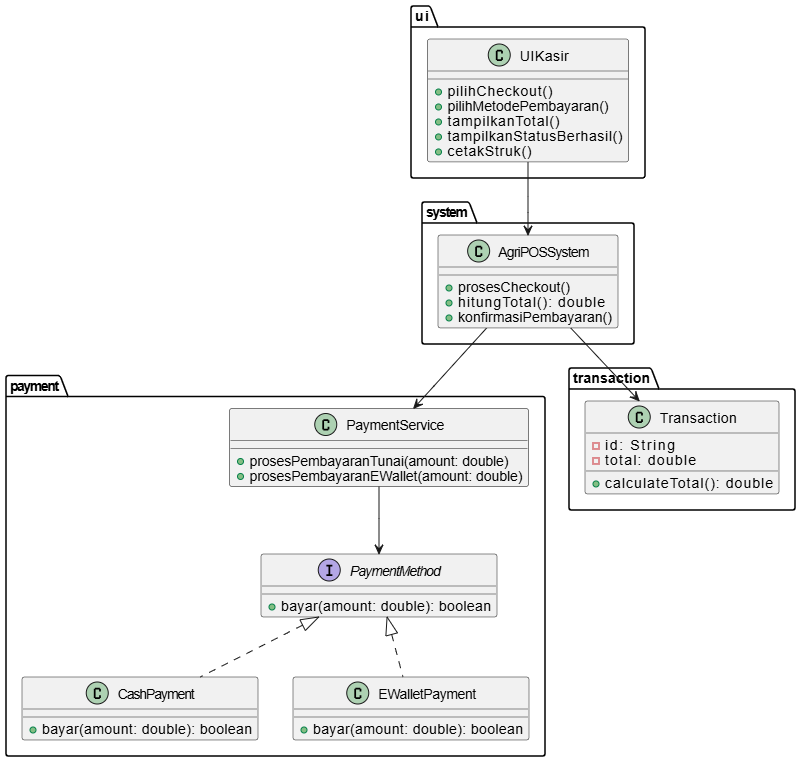
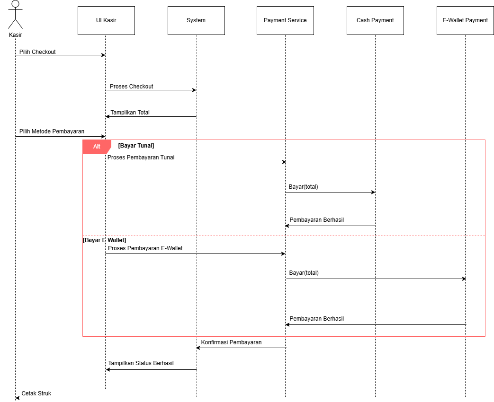
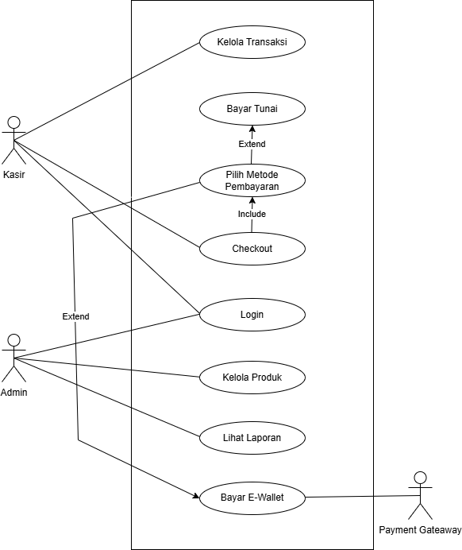

# Laporan Praktikum Minggu 6 
<<<<<<< HEAD
Topik: [Desain Arsitektur Sistem dengan UML dan Prinsip SOLID]

## Identitas
- Nama  : [Muhammad Firly Ramadhan]
- NIM   : [240202872]
- Kelas : [3IKRB]
=======
Topik: Desain Arsitektur Sistem dengan UML dan Prinsip SOLID

## Identitas
- Nama  : Muhammad Firly Ramadhan
- NIM   : 240202872
- Kelas : 3IKRB
>>>>>>> 57e3ecdc4c502288ea209819dc216b7fa1f7a786

---

## Tujuan
Mahasiswa mampu :
1. Mahasiswa mampu mengidentifikasi kebutuhan sistem ke dalam diagram UML.
2. Mahasiswa mampu menggambar UML Class Diagram dengan relasi antar class yang tepat.
3. Mahasiswa mampu menjelaskan prinsip desain OOP (SOLID).
4. Mahasiswa mampu menerapkan minimal dua prinsip SOLID dalam kode program.

---

## Dasar Teori
1. Use Case Diagram
Use Case Diagram menggambarkan fungsi utama sistem Agri-POS dan interaksi antara aktor Kasir dan Admin dengan sistem.

2. Activity Diagram
Activity Diagram menunjukkan alur proses checkout mulai dari pemilihan produk, pembayaran, hingga pencetakan struk.

3. Sequence Diagram
Sequence Diagram menjelaskan urutan interaksi antar objek dalam proses pembayaran sesuai metode yang dipilih.

4. Class Diagram
Class Diagram menampilkan struktur kelas dan hubungan antar kelas dalam sistem Agri-POS.

---

## Langkah Praktikum
1. Menganalisis kebutuhan sistem Agri-POS berdasarkan deskripsi fungsional.
2. Mengidentifikasi aktor dan fungsi utama sistem.
3. Membuat Use Case Diagram menggunakan PlantUML di draw.io.
4. Menyusun Activity Diagram untuk proses checkout.
5. Membuat Sequence Diagram untuk alur pembayaran.
6. Merancang Class Diagram sesuai struktur sistem.
7. Menyimpan hasil diagram dalam format PNG/PDF.
8. Memeriksa konsistensi antara Use Case, Activity, Sequence, dan Class Diagram.
9. Menyusun laporan praktikum dan menarik kesimpulan.

---

## Hasil Eksekusi
<<<<<<< HEAD

---

## Analisis
(
Berdasarkan kebutuhan sistem Agri-POS, sistem harus mampu mendukung proses transaksi penjualan, pengelolaan produk, dan pembayaran dengan beberapa metode. Analisis dilakukan untuk mengidentifikasi aktor, fungsi utama, serta alur proses yang terjadi dalam sistem. Hasil analisis digunakan sebagai dasar dalam pembuatan Use Case, Activity, Sequence, dan Class Diagram agar desain sistem konsisten dan sesuai dengan kebutuhan pengguna. 
)
---

## Kesimpulan
(Berdasarkan hasil perancangan UML pada sistem Agri-POS, dapat disimpulkan bahwa penggunaan Use Case, Activity, Sequence, dan Class Diagram membantu memahami kebutuhan, alur proses, serta struktur sistem secara jelas. Perancangan ini menghasilkan desain sistem yang terstruktur dan konsisten sehingga memudahkan pengembangan dan pemeliharaan sistem di tahap selanjutnya.)
=======
Activity :

Class Diagram :

Sequence :

Use Case Diagram :

---

## Analisis
Berdasarkan kebutuhan sistem Agri-POS, sistem harus mampu mendukung proses transaksi penjualan, pengelolaan produk, dan pembayaran dengan beberapa metode. Analisis dilakukan untuk mengidentifikasi aktor, fungsi utama, serta alur proses yang terjadi dalam sistem. Hasil analisis digunakan sebagai dasar dalam pembuatan Use Case, Activity, Sequence, dan Class Diagram agar desain sistem konsisten dan sesuai dengan kebutuhan pengguna. 

---

## Kesimpulan
Berdasarkan hasil perancangan UML pada sistem Agri-POS, dapat disimpulkan bahwa penggunaan Use Case, Activity, Sequence, dan Class Diagram membantu memahami kebutuhan, alur proses, serta struktur sistem secara jelas. Perancangan ini menghasilkan desain sistem yang terstruktur dan konsisten sehingga memudahkan pengembangan dan pemeliharaan sistem di tahap selanjutnya.
>>>>>>> 57e3ecdc4c502288ea209819dc216b7fa1f7a786

---

## Quiz
<<<<<<< HEAD
(
1. Aggregation adalah hubungan lemah di mana objek dapat berdiri sendiri, sedangkan Composition adalah hubungan kuat di mana objek bergantung pada induknya.Contohnya AgriPOSSystem–PaymentService (aggregation) dan Transaction–detail transaksi (composition).

2. Open/Closed Principle membuat sistem mudah dikembangkan karena fitur baru dapat ditambahkan tanpa mengubah kode lama, misalnya menambah metode pembayaran baru melalui interface PaymentMethod.

3. Dependency Inversion Principle (DIP) meningkatkan testability karena kelas bergantung pada interface, sehingga mudah diganti dengan mock saat pengujian, contohnya PaymentService yang bergantung pada PaymentMethod.
)
=======
1. Aggregation adalah hubungan lemah di mana objek dapat berdiri sendiri, sedangkan Composition adalah hubungan kuat di mana objek bergantung pada induknya.Contohnya AgriPOSSystem–PaymentService (aggregation) dan Transaction–detail transaksi (composition).

2. Open/Closed Principle membuat sistem mudah dikembangkan karena fitur baru dapat ditambahkan tanpa mengubah kode lama, misalnya menambah metode pembayaran baru melalui interface PaymentMethod.

3. Dependency Inversion Principle (DIP) meningkatkan testability karena kelas bergantung pada interface, sehingga mudah diganti dengan mock saat pengujian, contohnya PaymentService yang bergantung pada PaymentMethod.
---

>>>>>>> 57e3ecdc4c502288ea209819dc216b7fa1f7a786
